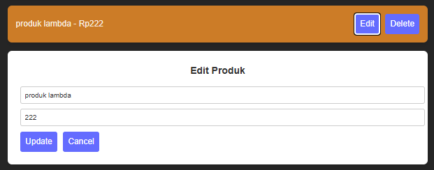

# Aplikasi E-commerce Proweb 

## Dzaky Rasyiq Zuhair - 10231035

## Link : https://github.com/Sourremon/ecommerce-kecil

## 1. Deskripsi proyek

Aplikasi E-commerce adalah proyek sederhana yang memungkinkan pengguna untuk mengatur produk secara online. Aplikasi ini dilengkapi dengan fitur dasar CRUD (Creat, Read, Update, Delete) yang responsif dan sederhana.

## 2. Cara penggunaan

### * Requirements

- **Node.js** (minimal versi 14)
- **NPM** (Node Package Manager)
- **PostgreSQL** (minimal versi 12)
- **Browser modern** seperti Chrome, Firefox, Safari, atau Edge


### Langkah Instalasi
1. **Clone repositori** ke komputer Anda:
   ```bash
   git clone https://github.com/username/proyek-ecommerce.git
   cd proyek-ecommerce

2. Buka terminal dan arahkan ke direktori proyek

3. Install dependensi backend:
```bash
cd backend
npm install
```

4. Install dependensi frontend:
```bash
cd frontend
npm install
```

### Menjalankan Aplikasi
1. Jalankan backend:
```bash
cd backend
node index.js
```
Server akan berjalan di `http://localhost:3000`

2. Jalankan frontend:
```bash
cd frontend
npm run dev
```
Aplikasi dapat diakses di `http://localhost:5173` atau port yang ditentukan

## 5. Struktur Proyek
```
proweb/
├── backend/
│   ├── index.js
│   ├── db.js
│   └── package.json
├── frontend/
│   ├── src/
│   │   ├── components/
│   │   │   ├── ProdukList.jsx
│   │   │   ├── ProdukForm.jsx
│   │   │   ├── Modal.jsx
│   │   │   └── Toast.jsx
│   │   ├── App.jsx
│   │   └── index.css
│   └── package.json
└── README.md
```

## 6. API Endpoints
### Produk
- `GET /produk` - Mendapatkan semua produk
- `POST /produk` - Menambah produk baru
- `PUT /produk/:id` - Memperbarui produk
- `DELETE /produk/:id` - Menghapus produk

## Screenshots

Here are some screenshots of the application:

### 1. **Home Page**


_Halaman utama menampilkan daftar produk dengan opsi untuk menambahkan, mengedit, atau menghapus produk_

### 2. **Add Product Form**


_Formulir untuk menambahkan produk baru dengan kolom input untuk nama dan harga._

### 3. **Edit Product Form**


_Formulir untuk memperbarui informasi produk yang sudah ada._